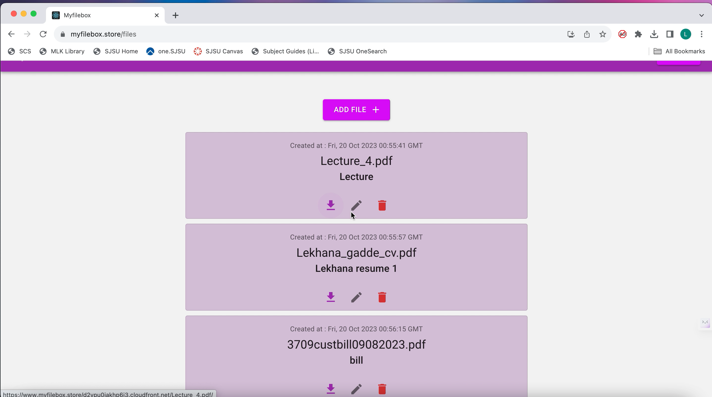
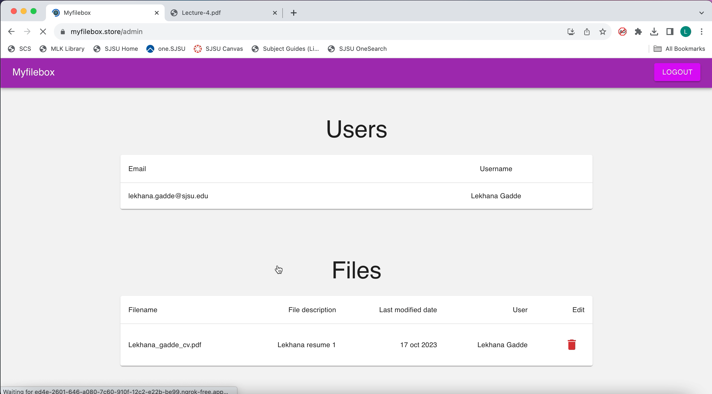

# CMPE 281- Cloud Technologies - Project1 - Myfilebox

University Name: San Jose State University (https://www.sjsu.edu/)
Professor’s Name: Sanjay Garje
Student Name: lekhana gadde
Student ID: 017461236

# Introduction

The need for a stable, approachable, and highly effective platform for file management and data security has never been greater in this age of technological innovation. Myfilebox.store is a website where we can manage and organize our documents in an efficient way. Our user-friendly platform has robust features which allows the users to easily download the files and update their files.This website lets you upload the files with the size of maximum 10MB.Whether your goal is to locate a certain document, update or remove files ,our website  acts as your doorway to simple file administration. It enhances your interactions with digital files, improving the effectiveness of daily chores and supporting the upkeep of digital order in your life with its friendly user interface and customizable features.

Tech Stack :  

Front end- React js
Back end - Flask
File storage - S3, RDS
User registration and authentication - Cognito 

# Architecture Diagram :

# Website link : 

https://myfilebox.store

# Organized and deployed version: 

https://github.com/Lekhana19/Myfilebox-deployedversion.git

# Demo Drive link :

https://drive.google.com/drive/folders/1DWTUT-5uwnJoKK90ZW6BfrJ7QhxqXd6d?usp=sharing

# AWS Services used

Route 53 - This is added to the domain to manage the traffic from different regions and reroute the traffic to different load balancers that are created.
ELB - Three different load balancers are used in the current project . Two of the load balancers are in the region us-east-1.
S3, cloud front - S3 storage is used for storing the files and cross region replication is done such that all the files that were uploaded are simultaneously replicated in different regions. Thus ensuring a reliable solution for storing the files. Cloud front is also added in front of the S3 such that users would get a faster download option.
Lambda - Lambda function is created to trigger the event whenever there is a delete in the S3 bucket  for the application.
SNS, Cloud watch -  An sns topic is created with the event subscription to let the customer know / notify in the email whenever there is an object delete.
DR Measures- for the disaster recovery purpose , we have created a replica in a different region for the S3 and also added the new load balancer to point out the application running in different region.
Highly available - By adding the replication with different regions and load balancers pointing the application is highly available.
Highly scalable - An auto scaling group is added infront to ensure the scaling of the instances whenever the instance is down.
Version control - For the current project , Github is used for the version control and a git repository is made for the website and all the code is pushed into it. 
Homepage

Loggedin List all files page

Admin page

