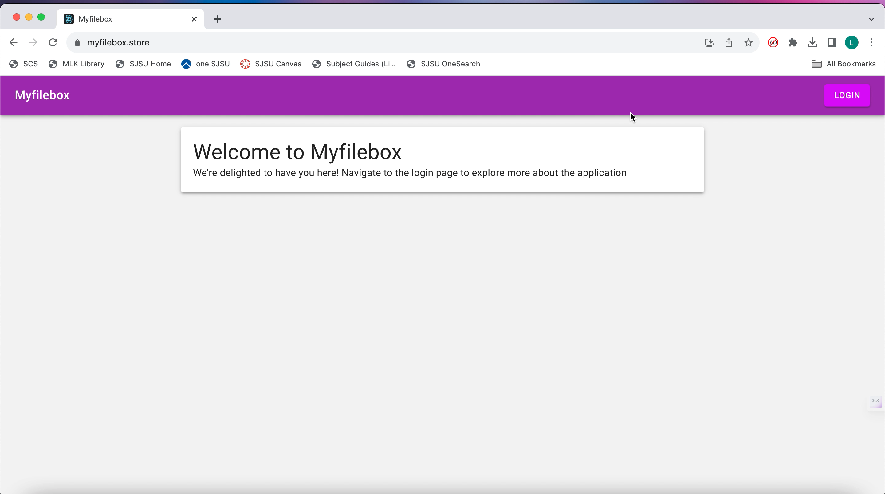

# Myfilebox

# Introduction

The need for a stable, approachable, and highly effective platform for file management and data security has never been greater in this age of technological innovation. Myfilebox.store is a website where we can manage and organize our documents in an efficient way. Our user-friendly platform has robust features which allows the users to easily download the files and update their files.This website lets you upload the files with the size of maximum 10MB.Whether your goal is to locate a certain document, update or remove files ,our website  acts as your doorway to simple file administration. It enhances your interactions with digital files, improving the effectiveness of daily chores and supporting the upkeep of digital order in your life with its friendly user interface and customizable features.

# Tech Stack :  

Front end- React js
Back end - Flask
File storage - S3, RDS
User registration and authentication - Cognito 

# Architecture Diagram :

# Website link : 

https://myfilebox.store

# New repository for deployed version code

https://github.com/Lekhana19/Myfilebox-deployedversion.git

# Demo Drive link :
https://drive.google.com/drive/folders/1DWTUT-5uwnJoKK90ZW6BfrJ7QhxqXd6d?usp=sharing

# Homepage

